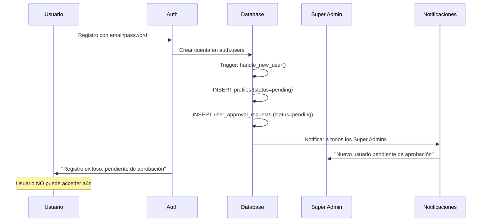
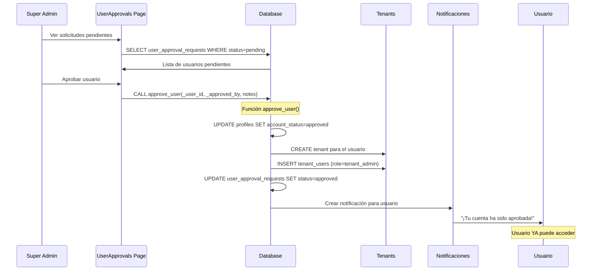
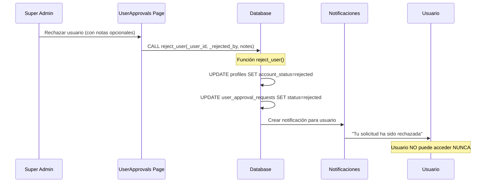
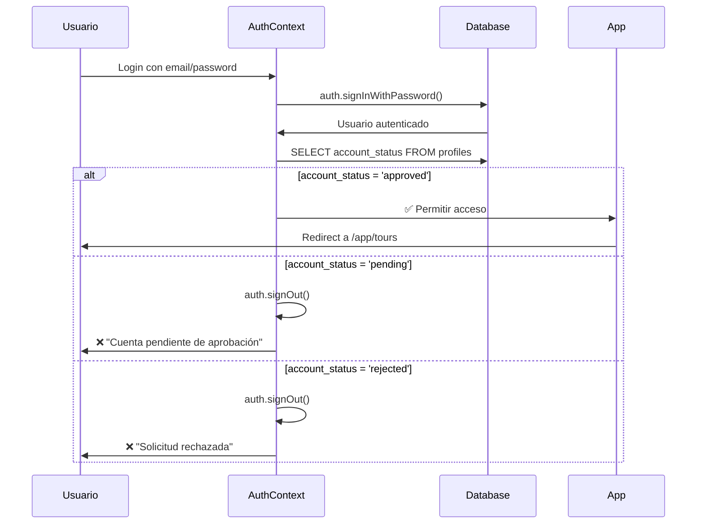
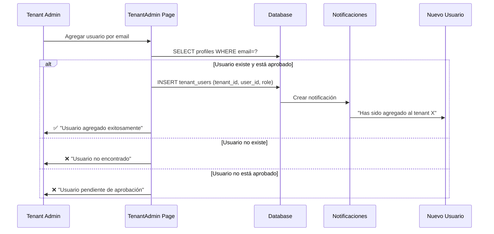

# 📋 Sistema Multi-Tenant con Aprobación Manual

## 🎯 Descripción General

Este sistema permite que múltiples organizaciones (tenants) usen la aplicación de forma aislada. Cada organización tiene sus propios usuarios, tours y datos, con un sistema de aprobación manual de nuevos registros.

---

## 🏗️ Arquitectura

### **Niveles de Acceso (Jerarquía)**

```
┌─────────────────────────────────────────┐
│         Super Admin (admin)             │  ← Gestiona TODO el sistema
│  - Aprobar/rechazar usuarios            │
│  - Gestionar todos los tenants          │
│  - Configurar feature flags             │
└─────────────────────────────────────────┘
                    ↓
┌─────────────────────────────────────────┐
│      Tenant Admin (tenant_admin)        │  ← Gestiona SU organización
│  - Invitar usuarios a su tenant         │
│  - Gestionar miembros                   │
│  - Administrar tours del tenant         │
└─────────────────────────────────────────┘
                    ↓
┌─────────────────────────────────────────┐
│           User (member)                 │  ← Usuario básico
│  - Crear y gestionar sus tours          │
│  - Ver tours de su tenant               │
│  - Colaborar con su equipo              │
└─────────────────────────────────────────┘
```

---

## 📊 Estructura de Datos

### **Tablas Principales**

#### `tenants` (Organizaciones)
```sql
- id                    uuid PRIMARY KEY
- name                  text              -- "Agencia XYZ"
- owner_id              uuid → profiles   -- Creador del tenant
- status                text              -- active, suspended, inactive
- subscription_tier     text              -- free, basic, premium, enterprise
- settings              jsonb             -- Configuración personalizada
- created_at            timestamp
```

#### `tenant_users` (Relación Usuario-Tenant)
```sql
- id                    uuid PRIMARY KEY
- tenant_id             uuid → tenants
- user_id               uuid → profiles
- role                  tenant_role       -- tenant_admin, member
- created_at            timestamp

UNIQUE(tenant_id, user_id)  -- Un usuario no puede estar duplicado en el mismo tenant
```

#### `profiles` (Usuarios)
```sql
- id                    uuid PRIMARY KEY
- email                 text UNIQUE
- full_name             text
- account_status        text              -- pending, approved, rejected
- created_at            timestamp
```

#### `user_approval_requests` (Solicitudes de Registro)
```sql
- id                    uuid PRIMARY KEY
- user_id               uuid → profiles
- status                text              -- pending, approved, rejected
- requested_at          timestamp
- reviewed_at           timestamp
- reviewed_by           uuid → profiles
- notes                 text              -- Comentarios del revisor
```

---

## 🔄 Flujo de Trabajo

### **1️⃣ Registro de Nuevo Usuario**



**Código relevante:**
- `src/pages/Auth.tsx` (línea 91-94)
- Trigger DB: `handle_new_user()` en `supabase/migrations/`

---

### **2️⃣ Aprobación por Super Admin**



**Código relevante:**
- `src/pages/UserApprovals.tsx` (línea 98-121)
- Función DB: `approve_user()` en `supabase/migrations/`

---

### **3️⃣ Rechazo por Super Admin**



---

### **4️⃣ Login de Usuario**



**Código relevante:**
- `src/contexts/AuthContext.tsx` (línea 53-79)

---

### **5️⃣ Gestión de Usuarios por Tenant Admin**



**Código relevante:**
- `src/pages/TenantAdmin.tsx` (línea 109-166)

---

## 🛡️ Seguridad (Row Level Security)

### **Políticas RLS Críticas**

#### Para `tenants`:
```sql
-- Solo super admin puede ver todos los tenants
CREATE POLICY "Super admin can view all tenants"
ON tenants FOR SELECT
USING (is_super_admin(auth.uid()));

-- Usuarios ven solo sus tenants
CREATE POLICY "Users can view their tenants"
ON tenants FOR SELECT
USING (
  auth.uid() = owner_id OR
  EXISTS (
    SELECT 1 FROM tenant_users
    WHERE tenant_id = tenants.id AND user_id = auth.uid()
  )
);
```

#### Para `virtual_tours`:
```sql
-- Usuarios ven solo tours de su tenant
CREATE POLICY "Users can view tours in their tenant"
ON virtual_tours FOR SELECT
USING (
  belongs_to_tenant(auth.uid(), tenant_id)
);

-- Tours públicos visibles para todos
CREATE POLICY "Published tours are viewable by everyone"
ON virtual_tours FOR SELECT
USING (is_published = true);
```

#### Para `user_approval_requests`:
```sql
-- Solo super admins ven solicitudes
CREATE POLICY "Super admins can view all approval requests"
ON user_approval_requests FOR SELECT
USING (is_super_admin(auth.uid()));
```

---

## 🎨 Páginas Administrativas

### **1. SuperAdminDashboard** (`/app/super-admin`)
**Acceso:** Solo Super Admin

**Funcionalidades:**
- ✅ Ver todos los tenants del sistema
- ✅ Crear nuevos tenants manualmente
- ✅ Editar tenants (nombre, status, subscription_tier)
- ✅ Eliminar tenants
- ✅ Ver estadísticas globales (AllTenantsStats)
- ✅ Acceder a Feature Management
- ✅ Acceder a User Approvals

**Código:** `src/pages/SuperAdminDashboard.tsx`

---

### **2. UserApprovals** (`/app/user-approvals`)
**Acceso:** Solo Super Admin

**Funcionalidades:**
- ✅ Ver solicitudes pendientes, aprobadas y rechazadas
- ✅ Aprobar usuarios (crea tenant automáticamente)
- ✅ Rechazar usuarios (con notas opcionales)
- ✅ Estadísticas de aprobaciones
- ✅ Filtros por estado (Tabs)

**Código:** `src/pages/UserApprovals.tsx`

---

### **3. TenantAdmin** (`/app/tenant-admin`)
**Acceso:** Tenant Admin del tenant actual

**Funcionalidades:**
- ✅ Ver usuarios del tenant
- ✅ Agregar usuarios existentes al tenant
- ✅ Cambiar roles (user ↔ tenant_admin)
- ✅ Remover usuarios del tenant
- ✅ No puede modificar al owner del tenant

**Código:** `src/pages/TenantAdmin.tsx`

---

### **4. FeatureManagement** (`/app/feature-management`)
**Acceso:** Solo Super Admin

**Funcionalidades:**
- ✅ Gestionar feature flags globales
- ✅ Habilitar/deshabilitar features por tenant
- ✅ Configurar rollout gradual (%)
- ✅ Versionar features

**Código:** `src/pages/FeatureManagement.tsx`

---

## 🔧 Funciones de Base de Datos

### **Funciones Helper**

#### `is_super_admin(_user_id uuid) → boolean`
```sql
-- Verifica si un usuario es Super Admin
SELECT EXISTS (
  SELECT 1 FROM user_roles
  WHERE user_id = _user_id AND role = 'admin'
)
```

#### `belongs_to_tenant(_user_id uuid, _tenant_id uuid) → boolean`
```sql
-- Verifica si un usuario pertenece a un tenant
SELECT EXISTS (
  SELECT 1 FROM tenant_users
  WHERE user_id = _user_id AND tenant_id = _tenant_id
)
```

#### `is_tenant_admin(_user_id uuid, _tenant_id uuid) → boolean`
```sql
-- Verifica si un usuario es admin de un tenant
SELECT EXISTS (
  SELECT 1 FROM tenant_users
  WHERE user_id = _user_id 
    AND tenant_id = _tenant_id 
    AND role = 'tenant_admin'
)
```

---

### **Funciones de Negocio**

#### `approve_user(_user_id, _approved_by, _notes) → void`
**Responsabilidades:**
1. Cambiar `account_status` a 'approved'
2. Crear tenant para el usuario
3. Asignar rol `tenant_admin` en `tenant_users`
4. Actualizar `user_approval_requests`
5. Crear notificación para el usuario

#### `reject_user(_user_id, _rejected_by, _notes) → void`
**Responsabilidades:**
1. Cambiar `account_status` a 'rejected'
2. Actualizar `user_approval_requests`
3. Crear notificación para el usuario

#### `get_user_tenants(_user_id) → TABLE`
**Retorna:**
```sql
tenant_id, tenant_name, user_role
```
Para todos los tenants donde el usuario es miembro.

---

## 📱 Contextos React

### **TenantContext** (`src/contexts/TenantContext.tsx`)

**Estado:**
```typescript
interface TenantContextType {
  currentTenant: Tenant | null;      // Tenant actualmente seleccionado
  tenants: Tenant[];                 // Lista de tenants del usuario
  setCurrentTenant: (tenant) => void;
  loading: boolean;
  isTenantAdmin: boolean;            // ¿Es admin del tenant actual?
  refreshTenants: () => Promise<void>;
}
```

**Uso:**
```typescript
const { currentTenant, isTenantAdmin } = useTenant();

if (!currentTenant) {
  return <Alert>No hay tenant seleccionado</Alert>;
}

if (isTenantAdmin) {
  // Mostrar opciones de administración
}
```

---

## 🚀 Hooks Personalizados

### **useIsSuperAdmin** (`src/hooks/useIsSuperAdmin.ts`)

Verifica si el usuario actual es Super Admin.

```typescript
const { isSuperAdmin, loading } = useIsSuperAdmin();

if (loading) return <Loader />;
if (!isSuperAdmin) return <Unauthorized />;
```

---

## 🎯 Casos de Uso

### **Caso 1: Nueva Empresa Quiere Usar la App**

1. Dueño de empresa se registra en `/signup`
2. Super Admin recibe notificación
3. Super Admin revisa solicitud en `/app/user-approvals`
4. Super Admin aprueba → Se crea tenant automáticamente
5. Dueño recibe notificación y puede acceder
6. Dueño invita a su equipo desde `/app/tenant-admin`

---

### **Caso 2: Agregar Usuarios a un Tenant Existente**

**Opción A: Tenant Admin invita directamente**
1. Nuevo usuario debe registrarse primero
2. Super Admin aprueba
3. Tenant Admin invita desde `/app/tenant-admin`
4. Usuario ahora tiene acceso al tenant

**Opción B: Usuario solicita unirse**
- No implementado actualmente
- Requeriría sistema de "invitaciones pendientes"

---

### **Caso 3: Usuario Trabaja en Múltiples Empresas**

1. Usuario ya aprobado y con tenant A
2. Tenant Admin de empresa B lo invita
3. Usuario ve selector de tenants en `TenantSwitcher`
4. Usuario puede cambiar entre tenants
5. Datos están aislados por tenant

---

## ⚙️ Configuración Inicial

### **Crear Primer Super Admin**

```sql
-- 1. Registrar usuario normalmente
-- 2. Ejecutar en SQL:

INSERT INTO user_roles (user_id, role)
VALUES ('USER_ID_AQUI', 'admin');

-- 3. Actualizar account_status:
UPDATE profiles 
SET account_status = 'approved'
WHERE id = 'USER_ID_AQUI';
```

---

## 🐛 Solución de Problemas Comunes

### **Usuario no puede acceder después de registro**
✅ **Esperado:** Debe ser aprobado por Super Admin primero

### **Usuario aprobado no ve ningún tenant**
❌ **Problema:** No se creó tenant en aprobación
🔧 **Solución:** Verificar función `approve_user()` ejecutó correctamente

### **Tenant Admin no puede agregar usuarios**
❌ **Problema:** Usuario nuevo no está aprobado
🔧 **Solución:** Super Admin debe aprobar primero

### **Usuario ve tours de otros tenants**
❌ **Problema:** RLS policies incorrectas
🔧 **Solución:** Verificar `belongs_to_tenant()` en policies

---

## 📈 Métricas y Monitoreo

### **Consultas Útiles**

```sql
-- Total de tenants activos
SELECT COUNT(*) FROM tenants WHERE status = 'active';

-- Usuarios pendientes de aprobación
SELECT COUNT(*) FROM user_approval_requests WHERE status = 'pending';

-- Distribución de usuarios por tenant
SELECT t.name, COUNT(tu.user_id) as users_count
FROM tenants t
LEFT JOIN tenant_users tu ON t.id = tu.tenant_id
GROUP BY t.id, t.name
ORDER BY users_count DESC;

-- Tours por tenant
SELECT t.name, COUNT(vt.id) as tours_count
FROM tenants t
LEFT JOIN virtual_tours vt ON t.id = vt.tenant_id
GROUP BY t.id, t.name
ORDER BY tours_count DESC;
```

---

## 🔄 Mantenimiento

### **Limpieza de Solicitudes Antiguas**

```sql
-- Eliminar solicitudes rechazadas de hace más de 6 meses
DELETE FROM user_approval_requests
WHERE status = 'rejected' 
  AND reviewed_at < NOW() - INTERVAL '6 months';
```

### **Desactivar Tenants Inactivos**

```sql
-- Marcar tenants sin tours ni actividad en 90 días
UPDATE tenants
SET status = 'inactive'
WHERE id NOT IN (
  SELECT DISTINCT tenant_id 
  FROM virtual_tours 
  WHERE created_at > NOW() - INTERVAL '90 days'
)
AND status = 'active';
```

---

## 📚 Referencias Adicionales

- [Supabase RLS Documentation](https://supabase.com/docs/guides/auth/row-level-security)
- [Multi-Tenant Architecture Best Practices](https://docs.lovable.dev/)
- Código fuente: `src/pages/SuperAdminDashboard.tsx`
- Código fuente: `src/pages/UserApprovals.tsx`
- Código fuente: `src/pages/TenantAdmin.tsx`

---

## 🎨 Mejoras Futuras Sugeridas

1. **Dashboard de Métricas Avanzadas**
   - Actividad por tenant
   - Tours más visitados
   - Usuarios más activos

2. **Sistema de Invitaciones por Email**
   - Enviar invitación directa a email
   - Link de registro pre-aprobado

3. **Logs de Auditoría**
   - Registro de cambios en tenants
   - Historial de aprobaciones/rechazos

4. **Facturación por Tenant**
   - Integración con Stripe
   - Límites por subscription_tier

5. **Backups Automáticos por Tenant**
   - Exportar datos de un tenant
   - Restaurar datos eliminados

---

**Última actualización:** 2025-01-07  
**Mantenedor:** Sistema VirtualTour 360  
**Versión:** 2.0
